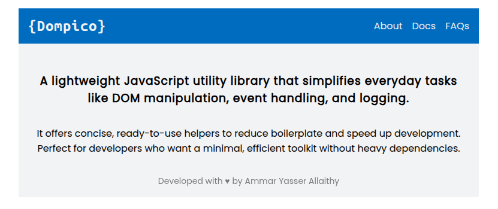

# Dompico



## Too easy to use

### Logging

Take one or more parameters and log them to console

```js
export const log = (...args) => args.forEach((arg) => console.log(arg));
```

Errors

```js
export const err = (...args) => args.forEach((arg) => console.error(arg));
```

### Elements Selection

Select single element using `querySelector()` function

```js
export const qs = (selector) => document.querySelector(selector);
```

Select multiple elements using `querySelectorAll()` function

```js
export const qsa = (selector) => document.querySelectorAll(selector);
```

### Elements Creation

Create single element with the tag name

```js
export const create = (tag) => document.createElement(tag);
```

Batch creating element by passing its all props as args

```js
export const creator = (args) => {
  let el = create(args.tag);

  if (args.id   ) el.id = args.id;
  if (args.cls  ) el.className = args.cls;
  if (args.text ) el.innerText = args.text;
  if (args.html ) el.innerHTML = args.html;
  if (args.value) el.value = args.value;

  if (args.style  ) Object.assign(el.style, args.style);
  if (args.childs ) el.appendAll(...args.childs);
  if (args.onClick) onClick(el, args.onClick);

  if (args.attrs)
    Object.entries(args.attrs)
      .forEach(([name, value]) => el.setAttribute(name, value))

  return el;
};
```

### Changing DOM

Append one or more child to an [HTMLElement]. It's a flexible version of `appendChild()`

```js
[el].appendAll(...childs) {
  childs.forEach(child => this.appendChild(child))
}
```

### Event Listeners

General registering listener

```js
export const on = (evt, el, behavior) => el.addEventListener(evt, behavior);
```

onClick listener

```js
export const onClick = (el, behavior) => on("click", el, behavior);
```

### Strings joining

Combine multiple strings in one string

```js
export const join = (...strings) => strings.join("");
```

...etc

## Example

HTML

```html
<body>
  <section></section>
</body>
```

Javascript

```js
const h1 = creator({
  tag: 'h2',
  text: `{${document.title}}`,
  style: {
    letterSpacing: '1px',
    fontFamily: 'JetBrains Mono, ubuntu mono',
  },
})

const ancStyle = {
  textDecoration: 'none',
  color: 'inherit',
}

const nav = creator({
  tag: 'nav',
  style: {
    display: 'flex',
    placeContent: 'space-around',
    gap: '1rem',
  },
  childs: [
    creator({
      tag: 'a',
      text: 'About',
      attrs: {
        href: '#about',
      },
      style: ancStyle,
    }),
    creator({
      tag: 'a',
      text: 'Docs',
      attrs: {
        href: '#docs',
      },
      style: ancStyle,
    }),
    creator({
      tag: 'a',
      text: 'FAQs',
      attrs: {
        href: '#faqs',
      },
      style: ancStyle,
    }),
  ],
})

const header = creator({
  tag: 'header',
  style: {
    background: '#1f75bf',
    color: '#f0f1f2',
    display: 'flex',
    placeContent: 'space-between',
    placeItems: 'center',
    padding: '1rem',
  },
  childs: [h1, nav],
})

const article = creator({
  tag: 'article',
  html: `
      <h3 style='margin: 2rem auto; letter-spacing: 1px'>
        A lightweight JavaScript utility library that simplifies everyday tasks like 
        DOM manipulation, event handling, and logging.
      </h3>
      <p>It offers concise, ready-to-use helpers to reduce boilerplate and speed up development.</p>
      <p>Perfect for developers who want a minimal, efficient toolkit without heavy dependencies.</p>
  `,
  style: {
    textAlign: 'center',
    padding: '1rem',
  },
})

const footer = creator({
  tag: 'footer',
  html: 'Developed with &hearts; by Ammar Yasser Allaithy',
  style: {
    opacity: 0.5,
    textAlign: 'center',
    fontSize: '14px',
    padding: '1rem',
  },
})


const container = qs('section')

container.appendAll(header, article, footer)

Object.assign(container.style, {
  background: '#f2f3f5',
  'font-family': 'Poppins',
  'max-width': '768px',
  margin: '1rem auto',
})
```

Preview


