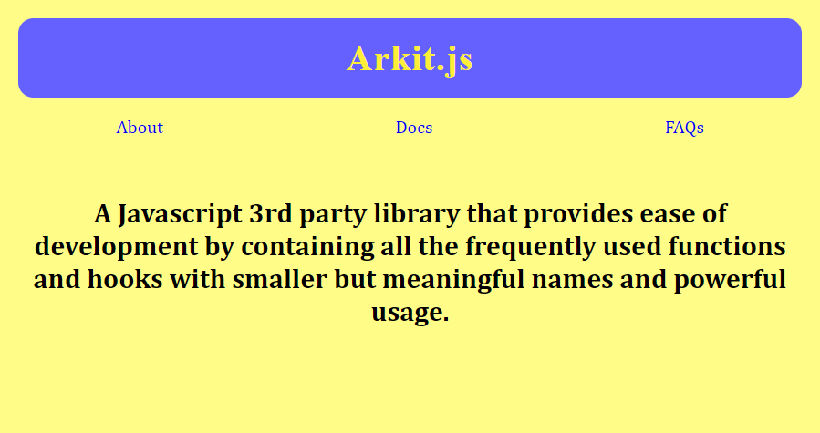

# Arkit.js

Arkit is a lightweight javascript library contains all the frequently used code snippets and hooks with smaller, meaningful names and powerful usage.

## Usage

### Logging

Take one or more parameters and log them to console

```js
const log = (...args) => args.forEach((arg) => console.log(arg));
```

### Elements Selection

Select single element using `querySelector()` function

```js
const qs = (selector) => document.querySelector(selector);
```

Select single element using `querySelectorAll()` function

```js
const qs = (selector) => document.querySelector(selector);
```

### Elements Creation

Create single element with the tag name

```js
const create = (tag) => document.createElement(tag);
```

Batch creating element by passing its all props as args

```js
const creator = (args) => {
  let el = create(args.tag);

  if (args.id) el.id = args.id;
  if (args.cls) el.className = args.cls;
  if (args.text) el.innerText = args.text;
  if (args.html) el.innerHTML = args.html;
  if (args.value) el.value = args.value;

  if (args.style) Object.assign(el.style, args.style);

  if (args.attrs)
    Object.entries(args.attrs).forEach(([name, value]) =>
      el.setAttribute(name, value)
    );

  if (args.childs) el.appendAll(...args.childs);

  if (args.onClick) onClick(el, args.onClick);

  return el;
};
```

### Changing DOM

Append one or more child to an [HTMLElement]. It's a flexible version of `appendChild()`

```js
[el].appendAll(...childs) {
  childs.forEach(child => this.appendChild(child))
}
```

### Event Listeners

General registering listener

```js
const on = (evt, el, behavior) => el.addEventListener(evt, behavior);
```

onClick listener

```js
const onClick = (el, behavior) => on("click", el, behavior);
```

### Strings joining

Combine multiple strings in one string

```js
const join = (...strings) => strings.join("");
```

...etc

## Example

```js
let h1 = creator({
  tag: "h1",
  text: document.title,
  style: {
    margin: "1rem",
    padding: "1rem",
    borderRadius: "10pt",
    color: "#FFEE37",
    background: "#6461FF",
    letterSpacing: ".05rem",
    textAlign: "center",
    fontFamily: "serif",
  },
});

let nav = creator({
  tag: "nav",
  style: {
    display: "flex",
    placeContent: "space-around",
    margin: "1rem auto",
  },
  childs: [
    creator({
      tag: "a",
      text: "About",
      attrs: {
        href: "#about",
      },
      style: {
        textDecoration: "none",
      },
    }),
    creator({
      tag: "a",
      text: "Docs",
      attrs: {
        href: "#docs",
      },
      style: {
        textDecoration: "none",
      },
    }),
    creator({
      tag: "a",
      text: "FAQs",
      attrs: {
        href: "#faqs",
      },
      style: {
        textDecoration: "none",
      },
    }),
  ],
});

let article = creator({
  tag: "article",
  html: "<h2>A Javascript 3rd party library that provides ease of development by containing all the frequently used functions and hooks with smaller but meaningful names and powerful usage.</h2>",
  style: {
    textAlign: "center",
    padding: "1rem",
  },
});

document.body.appendAll(h1, nav, article);
```


